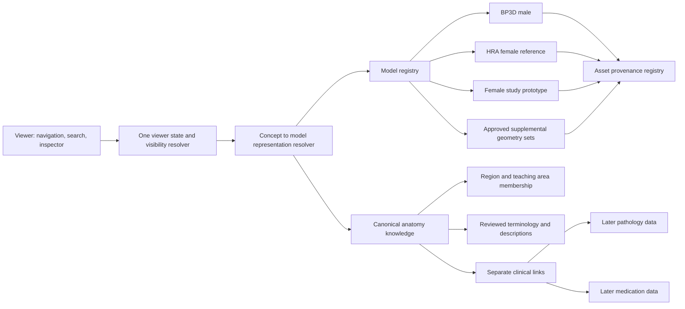

# Target architecture

**Decision:** retain the wiiiimm application and its current male/female routes as the working baseline. Register all three bundled manifests, including the currently unrouted HRA female reference, before adding features. The current female reconstruction is experimental, and no male-fitted supplement automatically follows it. The registry must carry availability and scientific status, not just a URL.

## Viewer contract

The route selects a `modelId` (`bp3d-male-4`, `hra-female-v1.5`, `female-study-v3`). A model registry records manifest URL, body frame, source datasets, available systems, geometry sets, mapping revision, license IDs and `experimental` status. One loader accepts the current monolithic chunks and future region/overview/context descriptors. It tracks fetch state per model and resolves part ID → loaded mesh. A switch discards model-specific part selection/hidden IDs, retains a canonical selected concept only if resolvable, and recomputes navigation and counts. It never applies the previous model's coordinates or transforms.

Viewer state is composed of `{modelId, selectedConceptIds, navigation(regionId, areaId), systems, depth, hiddenRepresentationIds, isolate, explode, breastView, camera}`. A pure resolver derives display, pickability and packing membership. Proposed precedence: absent/unloaded mesh is never pickable; user hidden mesh stays hidden until restore; isolation restricts to selected concept representations; navigation, system and depth filters restrict ordinary display; explicit search selection may reveal a mesh hidden by a system filter but must ask the resolver to restore a user-hidden mesh; context geometry is dim and unpickable. Test each pair of controls. Reset behavior must be specified at model, view and global scopes.

Keep the baseline r185 Three renderer initially. Add region lazy loading only after loader adapters prove full-body parity. Source-specific material and normals handling stay in a geometry adapter; meshes retain their own source IDs, transform, registration report, uncertainty, and license. An overview mesh is a rendering optimization, never a second anatomical concept. Visibility, selection and explosion operate on representation IDs; inspector, search and educational navigation operate on canonical concepts.

## Anatomy and navigation

Use one region taxonomy as an anatomical organization layer. Start with MVMT's nine useful region labels as candidates (`head-jaw`, `cervical`, `shoulder`, `thoracic`, `lumbar`, `hip`, `knee`, `elbow-wrist`, `ankle-foot`), review boundary/side definitions, and add a body/root view. A region can contain subregions; a structure can belong to multiple regions with a primary region. Region membership must not be inferred from which chunk stores a mesh.

Teaching areas are curated stations within one or more regions: Orbit, Circle of Willis, Brainstem, Larynx, Heart, Lung roots, Porta hepatis, Celiac trunk, Kidneys, Brachial plexus, Axilla, Cubital fossa, Wrist, Hand, Pelvic viscera, Popliteal fossa, Foot. The conceptual hierarchy is `Body → Region(s) → Teaching area(s) → Concept(s) → available model representation(s)`. A station may span regions (brachial plexus crosses cervical/shoulder), and a concept may occur in several stations. Explicit station membership replaces PR #1 regexes and centroid thresholds after a reviewed migration. Keep a separate context-member relation so nearby vessels/bones can teach a corridor without being mislabeled as the focal structure.

Search indexes canonical names, Latin names, aliases and typed source IDs. It returns concepts even when the current model lacks geometry, marked `text only` or `not available on this model`. The model resolver maps each concept to zero, one or many meshes, with side and detail level. Name matching is a candidate generator for editorial review, not a published key. MVMT `atlas.layers.mvmt` and `mvmt-fma-match.json` are useful migration evidence; their heuristics are not runtime truth.

Knowledge records hold cited descriptions/function/location/relationships. Clinical relevance is a separately reviewed collection linked to concepts. Later disease and medication collections link through typed, sourced relationships; no pathology or treatment text enters geometry manifests. MVMT exercise/drill postMessage code is outside the atlas target. A generic embed contract can be designed separately if needed.

## Promotion gates

Every geometry set needs reproducible source identity, a frozen asset hash, coordinate frame, transform/landmarks, male/female fit assessment, per-part review status and license proof. Every concept crosswalk needs a source ID and reviewer or explicit `unresolved`. Every text record needs source and review state. The baseline remains usable if a supplement fails a gate.
